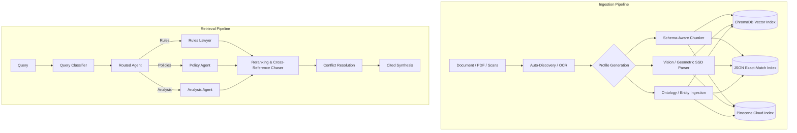

# Gaiia RAG Doll: Universal Document Analysis & Schema-Aware RAG

**Gaiia RAG Doll** is an advanced, domain-agnostic Retrieval-Augmented Generation (RAG) and document analysis platform. Originally created as an authoritative "Rules Lawyer" for resolving complex edge cases in dense tabletop simulation rulebooks, the engine has evolved into a universal document intelligence system capable of analyzing legal contracts, Home Insurance Product Disclosure Statements (PDS), structural diagrams, and domain ontologies.

Unlike standard RAG pipelines that split text purely by character counts, RAG Doll utilizes **schema-aware chunking**, **vision/geometric diagram parsing**, **dual-index storage** (ChromaDB + JSON Lookup + Pinecone), and a **6-stage reasoning retrieval pipeline**.

---

## 🌟 Key Features

- **Universal Agnosticism**: Driven entirely by dynamic JSON domain profiles that dictate parsing heuristics, retrieval logic, and persona prompts.
- **Vision & Geometric SSD Parsers**: Specialized parsers for extracting structural spatial diagrams, tabular damage grids, and matrix charts.
- **OCR Ingestion Pipeline**: Ingests scanned documents and legacy PDFs via Tesseract and vision-assisted OCR routines.
- **Ontology & Entity Ingestion**: Automatically extracts domain concepts, terms, and relational graphs into searchable entity registries.
- **Dedicated Agents**: Includes specialized agents for different retrieval modes:
  - `RulesLawyer`: Resolves rule edge cases and cross-references.
  - `PolicyAgent`: Evaluates insurance policies and coverage exclusions.
  - `AnalysisAgent`: Performs quantitative metric and trend analysis across document sets.
- **Temporal Conflict Resolution**: Detects superseded clauses across amendments/errata and prioritizes the authoritative version.
- **Hybrid Vector Storage**: Native support for local **ChromaDB** dense vector storage and cloud **Pinecone** vector databases.

---

## 🏗️ System Architecture



---

## 📂 Core Components (`engine/`)

### 1. Ingestion Engine (`engine/ingestion/`)
- `auto_discover.py`: Automatically scouts new document directories, detects schemas, and generates `profile.json`.
- `ingest_rules.py`: Standard schema-aware rulebook chunker.
- `ingest_policies.py`: Insurance PDS and legal clause ingestion.
- `ingest_entities.py`: Extracts named entities, actors, and assets.
- `ingest_analysis.py`: Ingests numerical and structured metrics.
- `vision_ssd_parser.py`: Vision-based parser for diagrammatic tables and layouts.
- `geometric_ssd_parser.py`: Coordinate-based spatial geometry extraction.
- `ocr_processor.py`: Optical Character Recognition pipeline for raster PDFs and images.
- `ontology_generator.py`: Generates domain taxonomy and semantic relationships.

### 2. Retrieval Engine (`engine/retrieval/`)
- `rules_lawyer.py`: Interactive and programmatic reference assistant with multi-hop citation chasing.
- `policy_agent.py`: Specialized legal and policy coverage evaluation agent.
- `analysis_agent.py`: High-level multi-document analytical synthesis agent.

---

## ⚙️ Installation & Setup

### Prerequisites
- **Python**: 3.11+ (Python 3.13 recommended)
- **Ollama**: Running locally with `nomic-embed-text` and `llama3.1:8b` or `qwen2.5:14b`:
  ```bash
  ollama pull nomic-embed-text
  ollama pull llama3.1:8b
  ```

### Install Dependencies
```bash
# Create and activate virtual environment
python -m venv venv
# On Windows:
.\venv\Scripts\activate
# On Linux/macOS:
source venv/bin/activate

# Install required packages
pip install chromadb sentence-transformers ollama pydantic pinecone pytest pillow pytesseract
```

---

## 🚀 Usage Guide

### 1. Auto-Discover a New Corpus
```bash
python engine/ingestion/auto_discover.py data/your_documents/ "Project Profile"
```

### 2. Ingest Rules or Policies
```bash
# Ingest standard rules
python engine/ingestion/ingest_rules.py --profile data/your_profile.json

# Ingest policy documents
python engine/ingestion/ingest_policies.py --profile data/policy_profile.json
```

### 3. Run the Reference Assistant
```bash
# Interactive Rules Lawyer
python engine/retrieval/rules_lawyer.py --profile data/your_profile.json

# Policy Agent Query
python engine/retrieval/policy_agent.py --profile data/policy_profile.json --query "Is flood damage covered?"
```

---

## 🧪 Testing Suite

Run the full automated test suite:

```bash
# Run via pytest
pytest tests/

# Run master runner
python tests/run_all_tests.py
```

### Key Test Coverage:
- `test_rules_lawyer.py`: Core 6-stage retrieval and citation logic.
- `test_policy_rag.py` & `test_insurance.py`: Policy evaluation and coverage assertions.
- `test_entity_rag.py`: Entity reconciliation and ontology search.
- `test_pinecone.py`: Pinecone hybrid vector database integration.
- `test_renegade_legion.py` / `test_asl_sample.py`: Complex multi-hop rule-lawyering edge cases.
