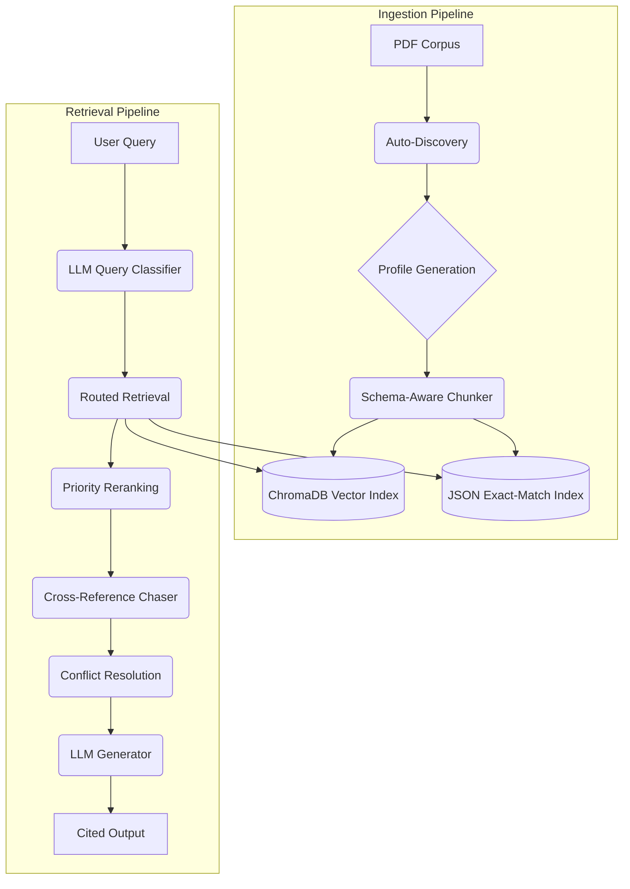
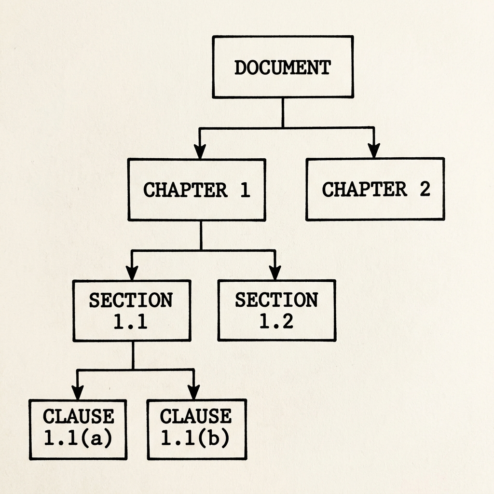
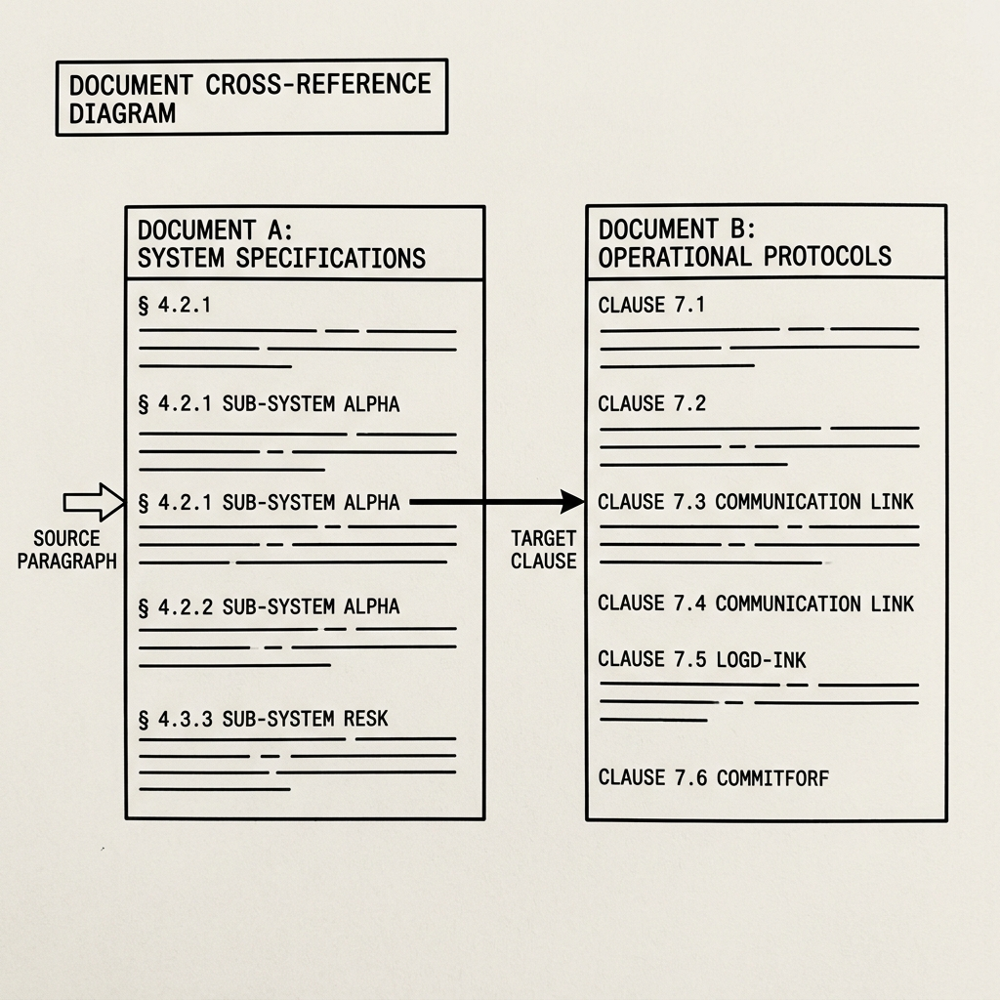

# Gaiia RAG Doll: Universal Document Analysis Engine

**Gaiia RAG Doll** is an advanced, domain-agnostic Retrieval-Augmented Generation (RAG) platform. Originally designed as an authoritative "Rules Lawyer" for resolving complex edge-cases in dense 1980s tabletop wargames (like *Up Front* and *Advanced Squad Leader*), the engine has evolved into a fully universal platform capable of analyzing everything from Warhammer 40K codices to dense legal contracts and Home Insurance Product Disclosure Statements (PDS).

Unlike standard RAG implementations that blindly chunk text by character count, this platform employs **semantic, schema-aware ingestion**, a **dual-index architecture**, and a **6-stage reasoning retrieval pipeline** to resolve cross-references, handle version conflicts, and guarantee perfectly cited answers.

> [!IMPORTANT]
> **Repository Note:** Because this project originated as a research tool for copyrighted wargames (Advanced Squad Leader, Up Front, Warhammer 40K), the proprietary rulebooks and codices are **not included** in this public repository. The `data/` directory contains only the sample Home Insurance documents (PDS, PEDs) to demonstrate the engine's universal applicability. However, all of the exhaustive wargaming test suites (e.g., `test_asl.py`, `test_40k_sample.py`) are fully preserved in the repository so you can see how the engine evaluates extreme rule-lawyering edge cases.

---

## 🌟 Key Features
- **Universal Agnosticism:** Driven entirely by JSON profiles. The engine automatically adapts its parsing heuristics, retrieval logic, and LLM persona to the specific domain of your corpus.
- **Model Swappability:** Built on [Ollama](https://ollama.com/), allowing models to be hot-swapped for specific pipeline stages (e.g., `llama3.1:8b` for fast classification, `qwen2.5:14b` for deep reasoning, `nomic-embed-text` for embeddings).
- **Temporal Conflict Resolution:** Automatically identifies when multiple editions or errata amendments of the same rule are retrieved, seamlessly prioritizing the latest authoritative text.
- **Cross-Reference Chasing:** Understands document citations (e.g., "See Clause 4.2(a)") and performs multi-hop fetches to bring all necessary context into the LLM's prompt.
- **Perfect Citations:** Enforces rigorous citation rules, mapping every generated factual statement back to the specific source document and semantic header.

---

## 🏗️ System Architecture

The platform is split into two primary pipelines: the **Ingestion Pipeline** and the **Retrieval Pipeline**. 



---

## 📥 Ingestion Pipeline Deep Dive

Standard RAG breaks text at arbitrary limits (e.g., every 500 tokens), frequently splitting critical rules in half. This engine uses structural awareness to keep semantic units intact.

### 1. Auto-Discovery (`auto_discover.py`)
When pointed at a new directory of documents, the Auto-Discovery script acts as a scout. It extracts a sample of text and uses an LLM to:
- **Detect the Semantic Schema:** It identifies the structural DNA of the corpus. Does it use Chapter Decimals (`A7.21`), Outline Parentheticals (`1.4(b)`), or Keyword Headers (`COVERAGE EXCLUSIONS`)? 
- **Categorize Documents:** Uses filename and content heuristics to classify documents as `primary_source`, `amendment/errata`, `supplement`, etc.
- **Extract Glossary:** Detects heavy use of abbreviations (e.g., `PDS`, `AFV`) and dynamically builds a glossary for the retriever.
- **Output:** Generates a dynamic `profile.json` that dictates how the ingestion and retrieval engines will handle this specific corpus.

### 2. Schema-Aware Chunking (`ingest_rules.py`)
Using the detected schema, the ingestion engine slices the text natively along its logical boundaries.



- **Tabular Preservation:** Automatically isolates and formats data-dense elements like stat blocks or coverage tables to prevent the LLM from losing matrix relationships.
- **Metadata Tagging:** Every chunk is stamped with its source document, semantic section header, document type, priority weight, and Edition/Version.

### 3. The Dual-Index Strategy
Chunks are committed to two separate databases simultaneously:
1. **ChromaDB:** Stored as dense vectors using `nomic-embed-text` for semantic fuzzy matching (e.g., "What happens if a flood destroys my fence?").
2. **JSON Lookup Index:** Stored as a deterministic key-value map for direct queries. If a user asks about "Clause 4.1", the engine bypasses semantic search entirely and fetches the exact chunk with zero hallucination.

---

## 🧠 Retrieval Pipeline Deep Dive

The retrieval engine (`rules_lawyer.py`) is designed to mimic the rigorous, methodical workflow of a legal professional or claims adjuster. 

### Stage 1: Query Classification
The user's natural language query is passed to a fast LLM (e.g., `llama3.1:8b`). Using the dynamic Domain Glossary, the classifier expands acronyms and categorizes the intent into one of several paths:
- `direct_rule`: Explicit lookup requests.
- `situation`: Complex edge-cases requiring synthesis.
- `comparison`: Questions regarding version changes or exceptions.

### Stage 2: Routed Retrieval
Based on the classification, the engine executes targeted searches against ChromaDB (using metadata filtering) and/or the JSON Lookup Index, massively oversampling the required chunks.

### Stage 3: Priority Reranking
Not all text is created equal. The engine reranks the retrieved context based on the **Priority Authority** assigned during Auto-Discovery. An `amendment/errata` document automatically floats to the top and supersedes the `primary_source` document.

### Stage 4: Cross-Reference Chasing
Legal documents and technical manuals rely heavily on cross-references. Before handing the context to the final LLM, a lightweight parsing routine scans the retrieved chunks for citations (e.g., "[See Section 4.5]"). 



If found, the engine executes a rapid 1-hop fetch to the JSON index, seamlessly pulling the referenced clause into the context window.

### Stage 5: Conflict Resolution (Temporal Alignment)
If the system detects that it has retrieved clauses from multiple conflicting editions (e.g., a 2014 policy and a 2024 policy), it actively intervenes. It organizes the context timeline and injects special instructions into the generator prompt to ensure it answers using the *latest* authoritative source.

### Stage 6: Answer Generation & Citation
The compiled context is handed to a heavy reasoning model (e.g., `qwen2.5:14b`). The dynamic system prompt instructs the model to act as an authoritative reference assistant for the specific domain. 
- The LLM first utilizes `<thinking>` tags to map out its legal reasoning.
- It then generates the final response, strictly adhering to the rule that **every factual assertion must be cited in brackets** directly to the source document and section header.
- If it handled an edition conflict in Stage 5, it concludes with a re-entrant prompt asking the user if they would like to know how the rule evolved over time.

---

## ⚙️ Usage

**1. Generate a Profile for a New Corpus:**
```bash
python engine/ingestion/auto_discover.py data/your_documents/ "Project Name"
```

**2. Ingest the Corpus:**
```bash
python engine/ingestion/ingest_rules.py --profile data/your_profile.json
```

**3. Run the Reference Assistant (Interactive Mode):**
```bash
python engine/retrieval/rules_lawyer.py --profile data/your_profile.json
```

---

## 🔄 Model Swappability
Gaiia RAG Doll is fully decoupled from proprietary model APIs. It interfaces directly with local Ollama instances, meaning you can run it entirely air-gapped on consumer hardware. 

To swap models, simply update the calls in `rules_lawyer.py` or `ingest_rules.py`. For example, you can upgrade the classifier to `llama3.3:70b` for enterprise deployments, or swap the embedding model to `mxbai-embed-large` for different multilingual semantic topologies. The architecture natively supports any drop-in replacement.
