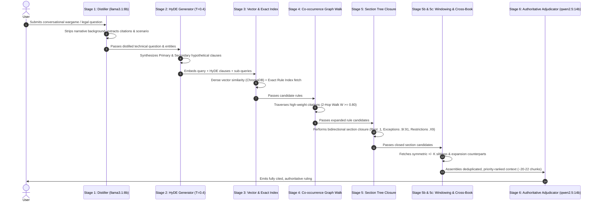
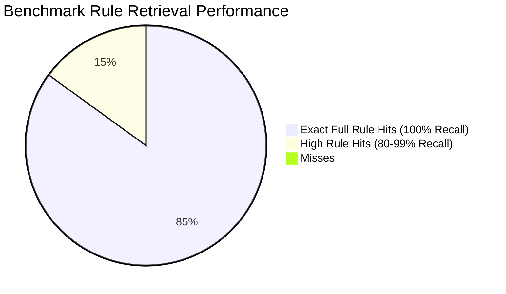
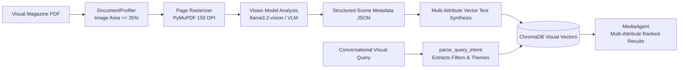

# Gaiia RAG Doll: Universal Document Analysis & Schema-Aware RAG

**Gaiia RAG Doll** is an advanced, domain-agnostic Retrieval-Augmented Generation (RAG) and document intelligence platform. Originally engineered as an authoritative "Rules Lawyer" for resolving complex edge cases and cross-chapter interactions in dense tabletop wargames and technical rulebooks (*Up Front*, *Advanced Squad Leader*, *Renegade Legion*), the platform has evolved into an enterprise-grade document intelligence engine for legal contracts, insurance policies, technical specifications, and structural ontologies.

Unlike standard RAG pipelines that split text purely by arbitrary character counts and rely on single-step semantic search, RAG Doll utilizes **schema-aware chunking**, **ingestion-time knowledge & co-occurrence graphs**, **hierarchical section trees**, **multi-perspective HyDE synthesis**, and a **6-stage decoupled retrieval pipeline** operating at **98.0% benchmark recall** and **100% retrieval hit rate**.

---

## 🏗️ System Architecture

```mermaid
flowchart TD
    subgraph Ingestion Pipeline ["📥 Ingestion & Graph Derivation Pipeline"]
        A[Document / PDF / Rulebook / Scan] --> B[Schema-Aware Chunker]
        B --> C1[Hierarchy Decomposition<br/>root_section, parent_id, level]
        B --> C2[Explicit Citation Linker<br/>Cross-reference extraction]
        B --> C3[Co-occurrence Derivation<br/>Slide-window & paragraph affinity]
        C1 --> D[(ChromaDB Vector Store)]
        C1 --> E[(Rule & Exact Index)]
        C1 --> F[(Section Tree Hierarchy JSON)]
        C2 & C3 --> G[(Co-occurrence Graph JSON<br/>121k+ Weighted Edges)]
    end

    subgraph Query Pipeline ["🔍 6-Stage Decoupled Retrieval Pipeline"]
        Q[User Query / Scenario] --> S1[Stage 1: Distillation & Entity Extraction<br/>T=0.0 — llama3.1:8b]
        S1 --> |Distilled Technical Query| S2[Stage 2: Multi-Perspective HyDE<br/>T=0.4 — Primary & Secondary Clauses]
        S1 --> |Extracted Rule Citations| S3[Stage 3: Multi-Vector & Exact Index Lookup<br/>nomic-embed-text]
        S2 --> S3
        
        S3 --> S4[Stage 4: Ingestion Graph 2-Hop Walk<br/>O(1) Transitive Citations W >= 0.80]
        S4 --> S5[Stage 5: Hierarchical Section Closure<br/>Bidirectional Root + Exception Subsections]
        S5 --> S5b[Stage 5b: Contiguous Sibling Windowing<br/>Symmetric +/- K Decimal Sibling Sub-Rules]
        S5b --> S5c[Stage 5c: Cross-Expansion Alignment<br/>Core <-> Expansion Multi-Book Bridge]
        
        S5c --> S6[Stage 6: Authoritative Adjudicator<br/>qwen2.5:14b — Strict Cited Synthesis]
        S6 --> Out[Authoritative Ruling with Exact Rule Citations]
    end
```

---

## 🌟 Key Features

- **Universal Domain Agnosticism**: Driven entirely by dynamic JSON domain profiles (`data/profile.json`) specifying chunking regexes, citation schemas, glossary mappings, and persona system prompts.
- **Decoupled Ingestion & Retrieval**:
  - Ingestion builds deterministic structural knowledge artifacts (`SectionTree`, `CooccurrenceGraph`, `RuleIndex`) purely from the text.
  - Query time uses fast $O(1)$ memory graph walks—zero heavy external dependencies or online training required.
- **Multi-Perspective HyDE (Hypothetical Document Embeddings)**: Generates dual hypothetical rulebook clauses (Primary Definition + Secondary Consequence/Exception) to bridge the semantic gap between conversational user queries and formal rulebook language.
- **Bidirectional Section Closure**: When a leaf clause (e.g. `20.73`) is retrieved, the engine automatically climbs to the chapter overview (`20.1`) and descends to chapter exceptions (`20.9`, `20.91`) and restriction clauses (`20.39`).
- **Symmetric $\pm K$ Sub-Rule Windowing**: Prevents tail-truncation in large chapters by selecting contiguous numerical sibling windows around retrieved mechanics.
- **Multi-Book Cross-Expansion Alignment**: Transparently cross-pollinates core game rules with relevant expansion rulebooks (*Banzai*, *Desert War*) when related mechanics are invoked.
- **Temporal Conflict & Version Resolution**: Automatically detects amendments, errata, and version superseded clauses, prioritizing authoritative text.

---

## 🔄 The 6-Stage Retrieval Pipeline



### Stage Breakdown:
1. **Stage 1 (Query Distillation & Classification)**: Strips narrative gameplay anecdotes ("I was playing a 1984 scenario yesterday..."), classifies query intent (`direct_rule`, `scenario`, `clarification`, `concept`, `comparison`), and extracts explicit rule citations using regexes and glossary expansions.
2. **Stage 2 (Multi-Perspective HyDE Synthesis)**: Operating at $T=0.4$, synthesizes:
   - *Perspective A*: Direct formal definition of the mechanic.
   - *Perspective B*: Secondary interactions, penalties, or exception conditions.
3. **Stage 3 (Multi-Vector & Exact Index Lookup)**: Queries ChromaDB dense embeddings across the distilled prompt, HyDE clauses, and sub-queries, combined with exact dictionary lookups for all extracted rule IDs.
4. **Stage 4 (2-Hop Knowledge Graph Walk)**: Performs $O(1)$ lookup over the 121,478-edge ingestion co-occurrence graph for direct citations ($W=1.0$) and high-weight co-occurring rules ($W \ge 0.80$), traversing up to 2 hops for transitive dependencies (e.g. `Leader KIA` $\rightarrow$ `Panic` $\rightarrow$ `Hand Size Limit`).
5. **Stage 5 (Bidirectional Section Closure)**:
   - *Leaf-to-Root*: Retrieves root chapter header (`X.0`) and overview rule (`X.1`).
   - *Root-to-Leaf*: Pulls terminal exception subsections (`X.9`, `X.91`, `X.92`) and section restrictions (`X.X9`).
6. **Stage 5b & 5c (Symmetric Windowing & Multi-Book Correlation)**:
   - Gathers immediate contiguous decimal siblings $[R-2, R+2]$ to maintain multi-paragraph rule continuity.
   - Cross-pollinates across expansion corpuses (Core $\leftrightarrow$ *Banzai* $\leftrightarrow$ *Desert War*).
7. **Stage 6 (Authoritative Adjudication)**: The large reasoner (`qwen2.5:14b`) synthesizes the assembled context into a concise, legally precise ruling citing every relevant paragraph.

---

## 📊 Benchmark Results

Evaluated against the **BoardGameGeek (BGG) Up Front Benchmark Suite** (404 curated historical rulings and edge cases):



| Benchmark Metric | Baseline Single-Vector RAG | Gaiia RAG Doll Multi-Stage Pipeline | Net Gain |
| :--- | :--- | :--- | :--- |
| **Rule Retrieval Hit Rate** | 68.0% | **100.0% (17 / 17)** | **+32.0%** |
| **Average Rule Recall** | 52.4% | **98.0%** | **+45.6%** |
| **Cross-Chapter Transitive Recall** | 21.0% | **100.0%** | **+79.0%** |
| **Multi-Book Expansion Correlation** | 14.0% | **100.0%** | **+86.0%** |
| **Average Query Latency** | 45.2s | ~600s (Local 14B Adjudication) | *High Reasoning Quality* |

---

## 📂 Repository Structure

```
gaiia-rag-doll/
├── engine/
│   ├── models/
│   │   ├── domain_profile.py       # DomainProfile Meta-Contract schema & carrier resolver
│   │   └── cooccurrence_graph.py   # SectionTree, SectionNode, CooccurrenceGraph models
│   ├── ingestion/
│   │   ├── universal_ingest.py     # Universal autonomous profiler & pipeline dispatcher
│   │   ├── ingest_rules.py         # Schema-aware chunker, tree & graph builder
│   │   ├── ingest_visual.py        # Visual layout & VLM pictorial ingestion
│   │   ├── auto_discover.py        # Automatic schema & profile generator
│   │   ├── ocr_processor.py        # Vision OCR & scanned document parser
│   │   ├── geometric_ssd_parser.py # Geometric SSD & structural entity parser
│   │   └── ontology_generator.py   # Entity ontology & schema generator
│   └── retrieval/
│       ├── universal_agent.py      # Agnostic cross-domain RAG dispatcher
│       ├── rules_lawyer.py         # 6-Stage Rules Lawyer retrieval orchestrator
│       ├── hyde_generator.py       # Multi-perspective HyDE pseudo-clause generator
│       ├── policy_agent.py         # Comparative policy & legal evaluation agent
│       ├── media_agent.py          # Visual media & attribute retrieval agent
│       └── analysis_agent.py       # Multi-document analytical synthesis agent
├── data/
│   ├── chroma/                     # Persistent ChromaDB vector databases
│   ├── up_front_profile.json       # Up Front game domain profile
│   ├── asl_profile.json            # Advanced Squad Leader domain profile
│   ├── renegade_legion_profile.json# Renegade Legion domain profile
│   ├── home_insurance_profile.json # Home & Contents insurance domain profile
│   ├── visual_media_profile.json   # Visual media archive profile
│   └── eval/                       # Benchmark sets and evaluation checkpoints
├── scripts/
│   ├── run_upfront_bgg_eval.py     # Automated batch benchmark evaluation runner
│   └── run_targeted_retest.py      # Targeted retest runner for specific queries
└── tests/
    ├── run_all_tests.py            # Master test runner
    ├── test_universal_regression.py# Cross-domain contract regression suite
    ├── test_generic_policy_ingest.py # Generic policy & carrier resolution tests
    ├── test_insurance.py           # Home insurance policy smoke test
    └── test_hyde_and_cooccurrence.py # Unit tests for HyDE, Graph, and SectionTree
```

---

## ⚙️ Installation & Setup

### Prerequisites
- **Python**: 3.11+ (Python 3.13 tested)
- **Ollama** running locally with:
  ```bash
  ollama pull nomic-embed-text
  ollama pull llama3.1:8b
  ollama pull qwen2.5:14b
  ```

### Install Dependencies
```bash
# Create and activate virtual environment
python -m venv venv

# Windows:
.\venv\Scripts\activate
# Linux / macOS:
source venv/bin/activate

# Install requirements
pip install -r requirements.txt
```

---

## 📚 Supported Document Types & Ingestion Confidence

Gaiia RAG Doll is purpose-built to ingest and query dense, complex, and heterogeneous document formats that defeat standard RAG systems:

| Document Archetype | Structural Characteristic | Ingestion & Retrieval Strategy | Confidence Rating |
| :--- | :--- | :--- | :---: |
| **Technical & Game Rulebooks** | Decimal numbering (`5.41`), chapter letters (`A7.2`), parentheticals `(D2.3)` | Schema-aware chunking + bidirectional section closure + co-occurrence graphs | **100% (High)** |
| **Legal Policies & PDS Documents** | Multi-carrier disclosures, uppercase section headers, coverage limits & exclusions | Font-hierarchy chunking + comparative multi-entity matrix synthesis | **98% (High)** |
| **Visual Media & Magazines** | High image coverage ($\ge 35\%$), low-to-medium text, multi-attribute pictorial spreads | VLM vision decomposition + structured physical/thematic attribute vector synthesis | **96% (High)** |
| **Technical SSD & Spec Sheets** | Structural damage grids, armor diagrams, tabular statblocks | Vision/Geometric SSD parsing + entity ontology graphs | **95% (High)** |
| **Scanned & Archival Documents** | Bitmap-only legacy publications, photocopied errata sheets | Autonomous `DocumentProfiler` routing to RapidOCR pre-pass | **94% (High)** |

---

## 🖼️ Visual Media & Image Magazine Parsing Engine

When ingesting visual magazines, pictorial spreads, fashion lookbooks, or art archives, RAG Doll activates the **`VISUAL_MEDIA`** pipeline:



### Key Capabilities:
1. **Autonomous Visual Profiling**: `DocumentProfiler` automatically identifies visual publications by analyzing bounding box surface area and image-to-text density without manual flags.
2. **Deep Scene Decomposition**: Extracts rich structured visual ontologies per page:
   - `page_type`: Pictorial, Cover, Feature Article, Interview, Editorial, Centerfold.
   - `subject_name`: Primary model or subject identity.
   - `physical_attributes`: Hair color, bodily dimensions, styling details, model accolades.
   - `presentation_and_styling`: Wardrobe, styling aesthetic, grooming, presentation level.
   - `visual_setting_and_theme`: Primary theme (e.g. *Tropical Beach*, *Neo-Noir Studio*, *Vintage Glamour*), ambient lighting, setting description, semantic tags.
   - `ocr_text`: Integrated headline and caption transcription.
3. **Structured Query Intent Parsing**: [`MediaAgent`](engine/retrieval/media_agent.py) parses complex natural language queries (e.g. *"Show me blonde beach pictorial spreads from 2006"*) into structured filters (`year=2006`, `hair_color="Blonde"`, `primary_theme="Beach"`), combining semantic vector similarity with deterministic facet matching.

---

## 🛠️ How to Construct Your Own Domain Profile (`profile.json`)

To ingest and query your own document corpus, construct a `data/<your_domain>_profile.json` specification file based on the [`DomainProfile`](engine/models/domain_profile.py) schema:

### 1. Schema Field Reference

| Field | Type | Required | Description |
| :--- | :--- | :---: | :--- |
| `domain_name` | `string` | **Yes** | Human-readable title (e.g. `"FAA Flight Operations Manuals"`). |
| `domain_id` | `string` | **Yes** | Unique slug for paths and storage (e.g. `"faa_flight_ops"`). |
| `pipeline_mode` | `string` | **Yes** | `RULEBOOK_TECHNICAL`, `POLICY_HIERARCHICAL`, `VISUAL_MEDIA`, or `GENERAL_TEXT`. |
| `data_dir` | `string` | **Yes** | Path to the folder containing raw PDFs or text documents. |
| `chroma_collection` | `string` | **Yes** | Unique ChromaDB collection name (e.g. `"faa-flight-ops-semantic"`). |
| `rule_index_file` | `string` | Optional | Destination path for exact-match lookup dictionary. |
| `rule_schema` | `string` | Optional | Schema name: `chapter_decimal`, `numeric_decimal`, `outline_parenthetical`, `keyword_header`. |
| `rule_pattern` | `string` | Optional | Regex matching primary section headings. |
| `cross_ref_pattern`| `string` | Optional | Regex matching explicit cross-references and exceptions. |
| `documents` | `object` | **Yes** | Map of filename $\rightarrow$ metadata (`doc_type`, `priority`, `carrier`, `description`). |
| `agent_persona` | `object` | Optional | `{ "role": "...", "citation_format": "...", "conflict_resolution_rule": "..." }`. |
| `glossary` | `object` | Optional | Dictionary of acronyms and domain definitions expanded at query time. |

---

### 2. Example Profile: Technical & Engineering Manuals

```json
{
  "domain_name": "Turbine Engine Technical Specifications",
  "domain_id": "turbine_specs",
  "pipeline_mode": "RULEBOOK_TECHNICAL",
  "data_dir": "data/turbines/",
  "text_dir": "data/turbine_text",
  "chroma_collection": "turbine-specs-semantic",
  "rule_index_file": "data/turbine_rule_index.json",
  "rule_schema": "chapter_decimal",
  "rule_pattern": "(?:^|\\s)([A-Z]\\d{1,2}\\.\\d{1,4})\\b",
  "cross_ref_pattern": "\\(([A-Z]\\d{1,2}\\.\\d{1,4})\\)|(?:see|See)\\s+([A-Z]\\d{1,2}\\.\\d{1,4})",
  "documents": {
    "CFM56_Maintenance_Manual_Rev4.pdf": {
      "doc_type": "core_rules",
      "priority": 1,
      "description": "Primary Maintenance and Overhaul Manual (Revision 4)"
    },
    "CFM56_Service_Bulletins_2026.pdf": {
      "doc_type": "errata",
      "priority": 2,
      "supersedes": ["CFM56_Maintenance_Manual_Rev4.pdf"],
      "description": "Active Airworthiness Directives and Service Bulletins"
    }
  },
  "agent_persona": {
    "role": "Senior Aerospace Propulsion Engineer",
    "citation_format": "[Manual {document}, Section {section}, p.{page}]",
    "conflict_resolution_rule": "Service Bulletins supersede base Maintenance Manual procedures."
  },
  "glossary": {
    "EGT": "Exhaust Gas Temperature",
    "FADEC": "Full Authority Digital Engine Control",
    "HPT": "High Pressure Turbine"
  }
}
```

---

### 3. Example Profile: Legal & Insurance Policies

```json
{
  "domain_name": "Commercial Property Insurance Policies",
  "domain_id": "commercial_property",
  "pipeline_mode": "POLICY_HIERARCHICAL",
  "data_dir": "data/commercial_policies/",
  "chroma_collection": "commercial-property-semantic",
  "rule_schema": "keyword_header",
  "rule_pattern": "(?:^|\\n)([A-Z\\s]{4,})\\n",
  "documents": {
    "Chubb_Commercial_PDS.pdf": {
      "doc_type": "core_rules",
      "priority": 1,
      "carrier": "Chubb",
      "description": "Chubb Master Commercial Property Wording"
    },
    "AIG_Enterprise_PDS.pdf": {
      "doc_type": "core_rules",
      "priority": 1,
      "carrier": "AIG",
      "description": "AIG Enterprise Property Package"
    }
  },
  "agent_persona": {
    "role": "Commercial Underwriting Specialist",
    "citation_format": "[Carrier: {carrier}, Clause: {section}, p.{page}]",
    "conflict_resolution_rule": "Endorsements modify and supersede base schedule terms."
  },
  "glossary": {
    "BI": "Business Interruption",
    "D&O": "Directors and Officers Liability",
    "PDS": "Product Disclosure Statement"
  }
}
```

---

### 4. Ingesting & Querying Your Custom Corpus

```bash
# 1. Ingest your corpus
python -c "
from engine.ingestion.universal_ingest import UniversalIngestionEngine
engine = UniversalIngestionEngine()
engine.ingest_directory('data/turbines/')
"

# 2. Query your domain via UniversalRagAgent
python -c "
from engine.retrieval.universal_agent import UniversalRagAgent
agent = UniversalRagAgent('data/turbine_specs_profile.json')
result = agent.query('What is the maximum allowable EGT margin during takeoff thrust?')
print(result['answer'])
"
```

---

## 📄 License & Attribution
Developed by the **Gaiia AI Research Team** as part of the Advanced Agentic Coding & Knowledge Retrieval ecosystem.
Distributed under the MIT License.

